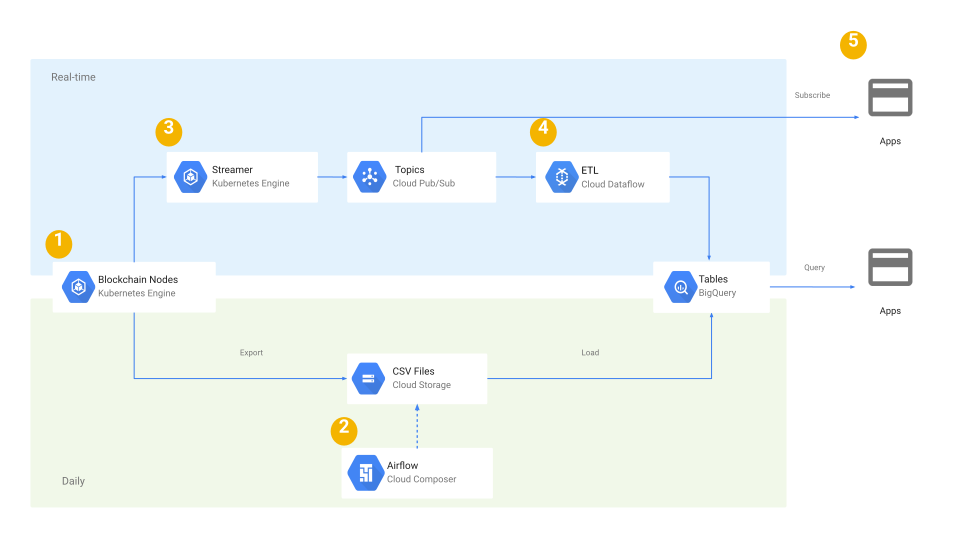

# IoTeX ETL

## Overview

IoTeX ETL allows you to setup an ETL pipeline in Google Cloud Platform for ingesting IoTeX blockchain data 
into BigQuery and Pub/Sub. It comes with [CLI tools](/cli) for exporting IoTeX data into JSON newline-delimited files
partitioned by day. 

Data is available for you to query right away in 
[Google BigQuery](https://console.cloud.google.com/bigquery?page=dataset&d=mainnet&p=iotex-etl).

## Architecture

[Google Slides version](https://docs.google.com/presentation/d/1VFMR4f8lghnpGZWZTevRTv6Zn9n9IUWHRnNrQsNE-8Y/edit#slide=id.p89)

1. The nodes are run in a Kubernetes cluster. 
    Refer to [IoTeX Node in Kubernetes](https://github.com/blockchain-etl/iotex-kubernetes) for deployment instructions.

2. [Airflow DAGs](https://airflow.apache.org/) export and load IoTeX data to BigQuery daily. 
    Refer to [IoTeX ETL Airflow](/airflow) for deployment instructions.
  
3. IoTeX data is polled periodically from the nodes and pushed to Google Pub/Sub. 
    Refer to [IoTeX ETL Streaming](/streaming) for deployment instructions.  
  
4. IoTeX data is pulled from Pub/Sub, transformed and streamed to BigQuery. 
    Refer to [IoTeX ETL Dataflow](/dataflow) for deployment instructions.  
 
## Setting Up

1. Follow the instructions in [IoTeX Node in Kubernetes](https://github.com/blockchain-etl/iotex-kubernetes) to deploy
    an IoTeX node in GKE. Wait until it's fully synced. Make note of the Load Balancer IP from the node deployment, it
    will be used in Airflow and Streamer components below.

2. Follow the instructions in [IoTeX ETL Airflow](/airflow) to deploy a Cloud Composer cluster for 
    exporting and loading historical IoTeX data. It may take several hours for the export DAG to catch up. During this
    time "load" and "verify_streaming" DAGs will fail. 

3. Follow the instructions in [IoTeX ETL Streaming](/streaming) to deploy the Streamer component. For the value in 
    `last_synced_block.txt` specify the last block number of the previous day. You can query it in BigQuery:
    `SELECT height FROM mainnet.blocks ORDER BY height DESC LIMIT 1`.

4. Follow the instructions in [IoTeX ETL Dataflow](/dataflow) to deploy the Dataflow component. Monitor 
    "verify_streaming" DAG in Airflow console, once the Dataflow job catches up the latest block, the DAG will succeed.